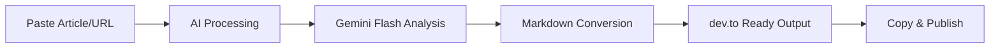

<div align="center">

# DevMD 

[](https://devmd.surydev.site/)
[](https://nextjs.org/)
[](https://reactjs.org/)
[](https://www.typescriptlang.org/)
[](https://tailwindcss.com/)
[](https://ui.shadcn.com/)
[](https://opensource.org/licenses/MIT)

**Transform your Medium and Peerlist articles into dev.to-ready Markdown with AI precision.**

[Live Demo](https://devmd.surydev.site/) · [Report Bug](https://github.com/suryanshsingh2001/devmd/issues) · [Request Feature](https://github.com/suryanshsingh2001/devmd/issues) · [Contribute](CONTRIBUTING.md)


</div>

---

## 📖 About

DevMD is an open-source tool that seamlessly converts Medium and Peerlist blog posts into dev.to-compatible Markdown format. Powered by **Google Gemini Flash**, DevMD ensures your content maintains its structure, readability, and context throughout the conversion process.

Whether you're cross-posting content, migrating your blog, or optimizing articles for different platforms, DevMD streamlines the entire workflow with AI-powered intelligence.

---

## ✨ Features

- 🤖 **AI-Powered Conversion** – Leverages Google's Gemini Flash for intelligent content transformation
- 🔗 **URL Import Support** – Paste Medium or Peerlist URLs for instant content extraction
- 📝 **Accurate Formatting** – Preserves headings, paragraphs, code blocks, and styling automatically
- ⚡ **Lightning Fast** – Convert articles in seconds with optimized AI processing
- 🎨 **Intuitive Interface** – Clean, modern design built with Next.js and shadcn/ui
- 🛡️ **Rate Limiting** – Built-in Arcjet protection for fair usage and API sustainability
- 🔓 **100% Open Source** – Transparent, community-driven development

---

## 🚀 Quick Start

### Prerequisites

Before you begin, ensure you have:

- **Node.js** v14 or later ([Download](https://nodejs.org/))
- **npm** or **yarn** package manager
- **Gemini API Key** from [Google AI Studio](https://makersuite.google.com/app/apikey)
- **Arcjet Key** (optional) from [Arcjet Dashboard](https://app.arcjet.com/)

### Installation

```bash
# Clone the repository
git clone https://github.com/suryanshsingh2001/devmd.git

# Navigate to project directory
cd devmd

# Install dependencies
npm install
# or
yarn install
```

### Environment Setup

Create a `.env.local` file in the root directory:

```env
# Required: Your Gemini API key
GEMINI_API_KEY=your_gemini_api_key_here

# Optional: Arcjet for rate limiting
ARCJET_KEY=your_arcjet_key_here

# Rate limiting configuration
RATE_LIMIT_ENABLED=true  # Set to 'false' to disable in development
MAX_REQUESTS=20

# Character limit per conversion
NEXT_PUBLIC_MAX_CHARACTERS=5000
```

> **Note:** Set `RATE_LIMIT_ENABLED=false` during local development to disable rate limiting.

### Running the Application

```bash
# Start development server
npm run dev
# or
yarn dev
```

Open [http://localhost:3000](http://localhost:3000) in your browser to start using DevMD.

---

## 💡 How It Works



1. **Input** – Paste your Medium/Peerlist article content or URL
2. **AI Analysis** – Gemini Flash parses and understands your content structure
3. **Conversion** – Content is transformed into dev.to-compatible Markdown
4. **Export** – Copy the formatted Markdown and publish directly to dev.to

---

## ⚠️ Current Limitations

| Feature | Status | Workaround |
|---------|--------|------------|
| 🖼️ **Image Support** | Not Available | Manual upload to dev.to required |
| ✂️ **Character Limit** | 5,000 characters | Split longer articles into parts |
| 🎥 **Embedded Content** | Limited | May require manual formatting |

---

## 🔮 Roadmap

### 🎯 Next Up

- [ ] Automated image extraction and upload to dev.to
- [ ] Increased character limit (10,000+ characters)
- [ ] Enhanced code block preservation with syntax highlighting
- [ ] Support for embedded tweets and YouTube videos

### 🚀 Future Vision

- [ ] **Browser Extension** – Convert articles with one click from Medium/Peerlist
- [ ] **Multi-Platform Export** – Hashnode, Ghost, WordPress support
- [ ] **SEO Optimizer** – AI-powered recommendations for better reach
- [ ] **Batch Processing** – Convert multiple articles simultaneously
- [ ] **Conversion History** – Track and manage all your conversions
- [ ] **Custom Templates** – Community-driven conversion profiles
- [ ] **Analytics Dashboard** – Monitor conversion performance

Have ideas? [Share them with us!](https://github.com/suryanshsingh2001/devmd/issues/new?template=feature_request.md)

---

## 🤝 Contributing

We love contributions from developers of all skill levels! DevMD is proudly participating in **Hacktoberfest 2025** 🎃

### Ways to Contribute

<table>
<tr>
<td width="25%">

**🐛 Bug Fixes**

Find and fix issues labeled [`bug`](https://github.com/suryanshsingh2001/devmd/labels/bug)

</td>
<td width="25%">

**✨ New Features**

Build features labeled [`enhancement`](https://github.com/suryanshsingh2001/devmd/labels/enhancement)

</td>
<td width="25%">

**📚 Documentation**

Improve docs labeled [`documentation`](https://github.com/suryanshsingh2001/devmd/labels/documentation)

</td>
<td width="25%">

**🎨 UI/UX**

Enhance design labeled [`ui/ux`](https://github.com/suryanshsingh2001/devmd/labels/ui)

</td>
</tr>
</table>

### Getting Started

```bash
# 1. Fork the repository on GitHub

# 2. Clone your fork
git clone https://github.com/YOUR_USERNAME/devmd.git

# 3. Create a feature branch
git checkout -b feature/amazing-feature

# 4. Make your changes and commit
git commit -m "feat: add amazing feature"

# 5. Push to your fork
git push origin feature/amazing-feature

# 6. Open a Pull Request
```

### Contribution Guidelines

✅ **Do:**
- Write meaningful commit messages
- Add tests for new features
- Update documentation when needed
- Follow the existing code style
- Be respectful and collaborative

❌ **Don't:**
- Submit untested code
- Make unrelated changes in one PR
- Ignore feedback from maintainers

Read our [Contributing Guidelines](CONTRIBUTING.md) and [Code of Conduct](CODE_OF_CONDUCT.md) for more details.

### 📋 Issue Templates

Use our templates when creating issues:

- [🐛 Bug Report](.github/ISSUE_TEMPLATE/bug_report.md)
- [✨ Feature Request](.github/ISSUE_TEMPLATE/feature_request.md)
- [📝 Pull Request](.github/PULL_REQUEST_TEMPLATE.md)

### 🎃 Hacktoberfest 2025

Contributing during October? Your PRs count toward Hacktoberfest!

**Ground Rules:**
1. Contributions must add real value
2. Test thoroughly before submitting
3. Follow project standards
4. Be patient and respectful

Check out [good first issues](https://github.com/suryanshsingh2001/devmd/labels/good%20first%20issue) to get started!

---

## ❓ FAQ

<details>
<summary><strong>What platforms does DevMD support?</strong></summary>
<br>
DevMD currently supports converting articles from Medium and Peerlist to dev.to format. Support for additional platforms (Hashnode, Ghost, WordPress) is planned for future releases.
</details>

<details>
<summary><strong>How many conversions can I do per day?</strong></summary>
<br>
The default limit is 20 conversions per day (configurable via MAX_REQUESTS). This ensures fair API usage and sustainability. Rate limiting can be disabled for local development.
</details>

<details>
<summary><strong>How do I handle images in my articles?</strong></summary>
<br>
Currently, images must be manually uploaded to dev.to. Automated image handling is our top priority feature and is actively being developed.
</details>

<details>
<summary><strong>Is DevMD free to use?</strong></summary>
<br>
Yes! DevMD is completely free and open source under the MIT License. However, you'll need your own Gemini API key, which has generous free tier limits from Google.
</details>

<details>
<summary><strong>Can I use DevMD for commercial purposes?</strong></summary>
<br>
Absolutely! The MIT License allows commercial use. Just remember to provide attribution and comply with Google's Gemini API terms of service.
</details>

<details>
<summary><strong>Which AI model powers DevMD?</strong></summary>
<br>
DevMD uses Google's Gemini Flash model, optimized for fast and high-quality text understanding and transformation.
</details>

<details>
<summary><strong>What's the character limit for conversions?</strong></summary>
<br>
Currently 5,000 characters per conversion. For longer articles, we recommend splitting them into multiple parts. We're working on increasing this limit.
</details>

<details>
<summary><strong>Do I need an Arcjet key?</strong></summary>
<br>
No, Arcjet is optional and only used for rate limiting. You can set RATE_LIMIT_ENABLED=false in your .env file to run without it.
</details>

---

## 🛠️ Tech Stack

<table>
<tr>
<td align="center" width="96">

<br>Next.js
</td>
<td align="center" width="96">

<br>React
</td>
<td align="center" width="96">

<br>TypeScript
</td>
<td align="center" width="96">

<br>Tailwind
</td>
</tr>
</table>

**Additional Technologies:**
- **UI Components:** shadcn/ui
- **AI Processing:** Google Gemini Flash
- **Rate Limiting:** Arcjet
- **Icons:** Lucide React

---

## 👥 Contributors

A huge thank you to all our contributors! 🎉

<a href="https://github.com/suryanshsingh2001/devmd/graphs/contributors">
  
</a>

Want to see your face here? [Start contributing today!](CONTRIBUTING.md)

---

## 📄 License

This project is licensed under the [MIT License](LICENSE). Feel free to use, modify, and distribute as you see fit.

---

## 📬 Connect & Support

**Maintainer:** [Suryansh Singh](https://www.linkedin.com/in/suryanshsingh2001/)

**Website:** [devmd.surydev.site](https://devmd.surydev.site/)

**Issues:** [GitHub Issues](https://github.com/suryanshsingh2001/devmd/issues)

---


## 🙏 Acknowledgments

- Built with ❤️ using [Next.js](https://nextjs.org/) and [shadcn/ui](https://ui.shadcn.com/)
- Powered by [Google Gemini](https://deepmind.google/technologies/gemini/)
- Icons provided by [Lucide](https://lucide.dev/)
- Rate limiting by [Arcjet](https://arcjet.com/)
- Inspired by the amazing developer community

---

<div align="center">

**Made with ❤️ by the DevMD community**

[⬆ back to top](#devmd)

</div>
